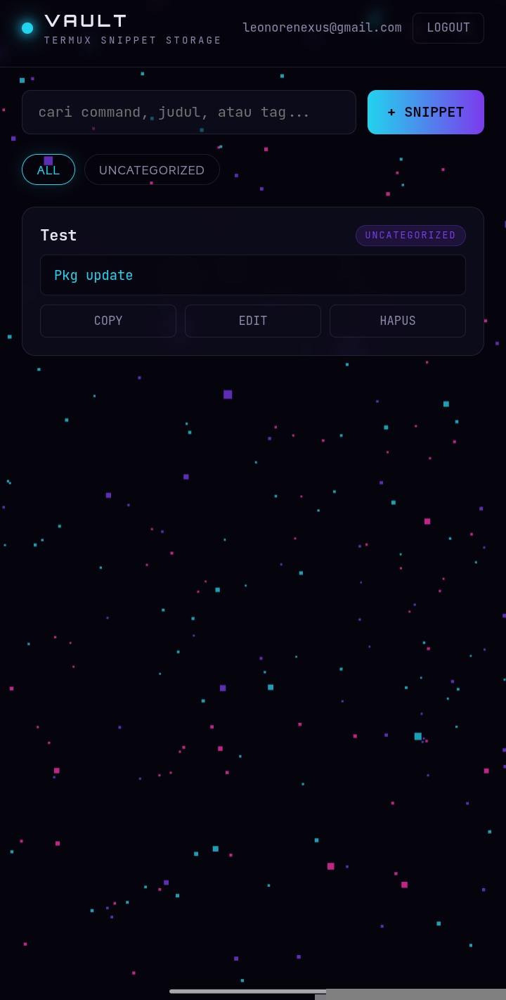

# ⚡ VAULT — Termux Snippet Storage

> _"a personal archive for every command you'll forget you ever needed"_

A private, cyberpunk-themed snippet manager for Termux, Kali, and Linux-on-Android command hoarders. Built for people who live inside a terminal but don't have a PC to keep notes on.


---

<p align="center">
  
</p>

---

## // WHAT IS THIS

Every time you fix a broken Kotlin build, wrangle `proot-distro`, or finally get Kali running clean in Termux — the exact command that saved you disappears into scrollback, never to be found again.

**VAULT** is where that command lives instead.

No app install. No PC. No Android Studio. Just a browser, a login, and a searchable archive of everything you've ever had to Google twice.

---

## // FEATURES

- 🔐 **Private by default** — email/password auth, Row Level Security means your snippets are yours alone
- 🔍 **Instant search** — filter by title, command text, or category as you type
- 🏷️ **Auto-categorization** — categories are just tags you type; filter chips generate themselves
- 📋 **One-tap copy** — command goes straight to clipboard, ready to paste into Termux
- 🌌 **Animated nebula background** — Three.js particle field, drifts with touch/cursor movement
- 📱 **Mobile-first** — built and tested entirely from a phone, because that's how it's used

---

## // STACK

| Layer | Tech |
|---|---|
| Frontend | Plain HTML / CSS / JS (no build step) |
| 3D Background | Three.js |
| Database + Auth | Supabase (Postgres + RLS) |
| Hosting | Vercel |

No framework, no bundler, no `npm install`. Edit `index.html`, push, done.

---

## // SETUP

Full walkthrough in [`SETUP.md`](./SETUP.md). Short version:

1. Run the schema in `SETUP.md` inside your Supabase SQL Editor
2. Drop your `Project URL` + `anon public key` into the config block at the top of `index.html`
3. Push to this repo → import into Vercel → deploy (static site, zero config)

---

## // UPDATING

Only `index.html` ever needs to change for feature/UI updates. Vercel auto-redeploys on every push. Database schema changes (rare) are the only thing that needs a trip back to Supabase's SQL Editor.

---

## // STRUCTURE

```
├── index.html     # the entire app — UI, auth, CRUD, nebula bg
└── SETUP.md       # database schema + deployment instructions
```

---

## // PART OF THE LEONORE STACK

Built alongside [COSMIQ DEPLOY](#), [MediaLink Pro](#), and [DRAGONIC LAS VEGA](#) — a set of tools built entirely from a phone, no PC required.

---

<sub>built from a phone, at 2am, in Termux's shadow.</sub>
